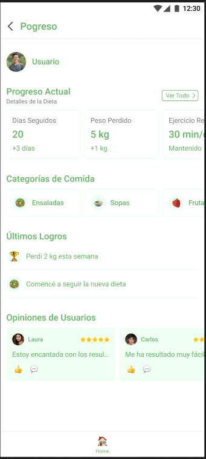
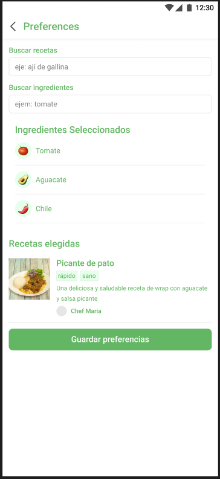
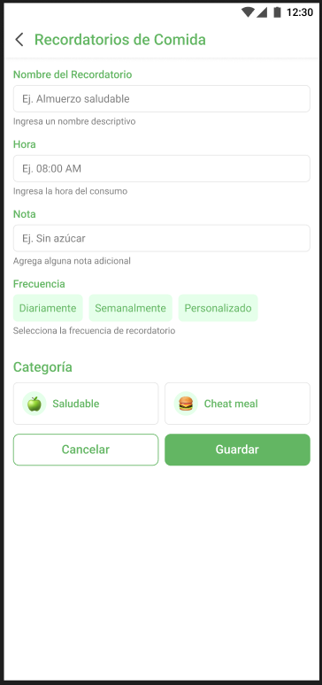
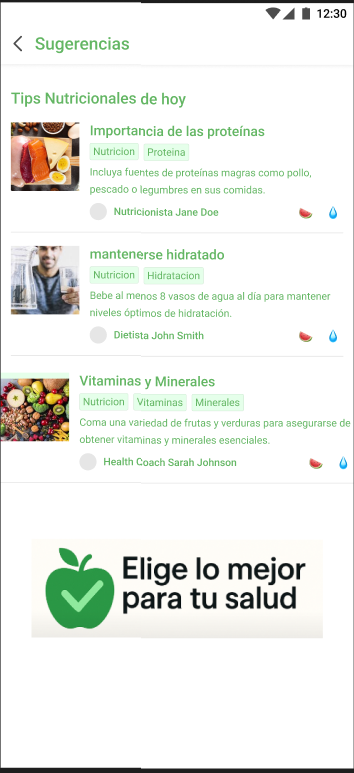
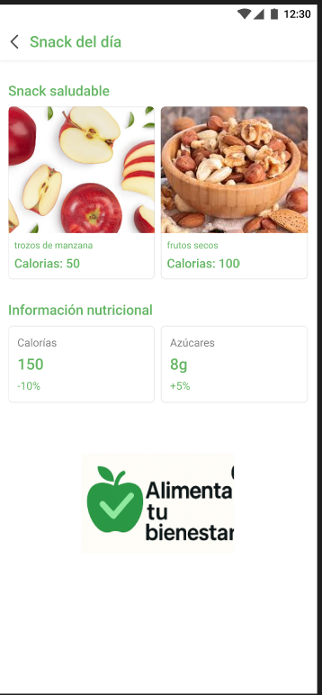
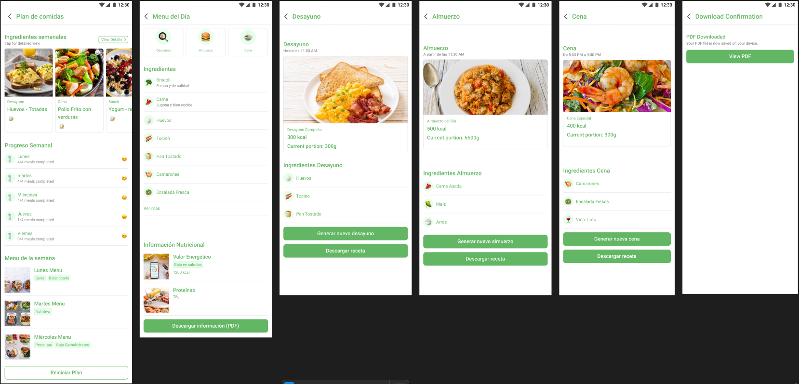
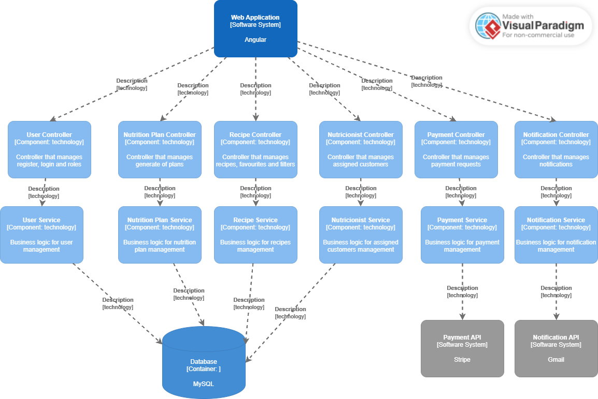
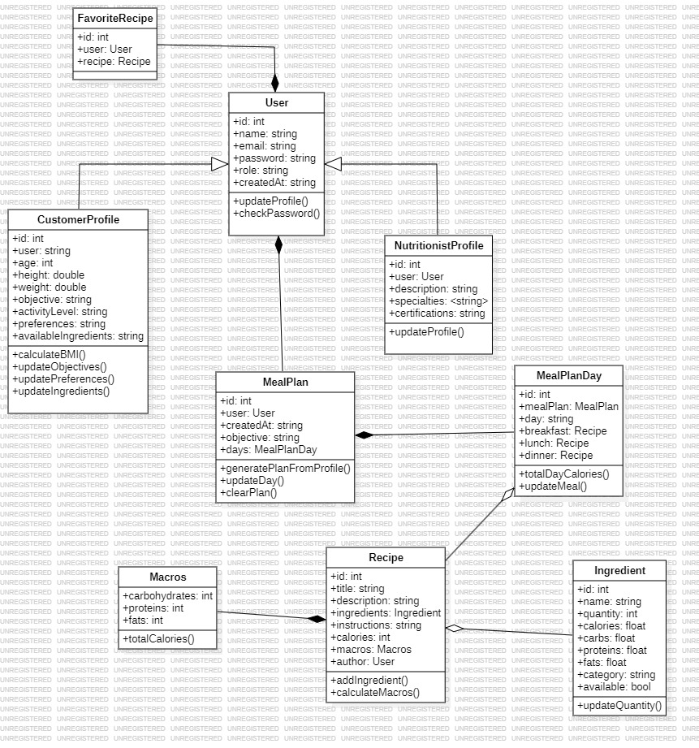

    

<h1 align="center">
    Universidad Peruana de Ciencias Aplicadas
</h1>

<h3 align="center">
    Carrera: Ingeniería de Software
       
    Curso: SI729 - Desarrollo de Aplicaciones Open Source
       
    Sección: 4328
       
    Profesor: Juan Antonio Flores Moroco
       
    Ciclo: 2025-01 
       
    Informe de Trabajo Final
       
    Startup: NutriVid
       
    Producto: NutriSmart  
</h3>

| 
Alumno
       | 
Código
 |
|:-------------------------------------------:|:-------------------------------------:|
|  Paredes Santos, Fabrizio Alberto           |              u202310914               |
|       Ríos Pacheco, Héctor Javier           |              u20231c540               |
| Prieto Mantari, Leonardo Fabrizzio Junior   |              u202319949               |
|       Rodriguez Macedo, Sebastian           |              u202310199               |
|       Linares Arroyo, Jorge Alexandro       |              u202318624               |

 Abril 2025 

## Registro de Versiones del Informe

## Project Report Collaboration Insights  

## Tabla de Contenidos

    
Capítulo I: Introducción 
    
        <ul>
            <li><a href="#11-Startup-Profile">1.1. Startup Profile</a></li>
            <li><a href="#111-Descripción-de-la-Startup">1.1.1. Descripción de la Startup</a></li>
            <li><a href="#112-Perfiles-de-Integrantes-del-Equipo">1.1.2. Perfiles de Integrantes del Equipo</a></li>
            <li><a href="#12-Solution-Profile">1.2. Solution Profile</a></li>
            <li><a href="#121-Antecedentes-y-Problemática">1.2.1. Antecedentes y Problemática</a></li>
            <li><a href="#122-Lean-UX-Process">1.2.2. Lean UX Process</a></li>
            <li><a href="#1221-Lean-UX-Problem-Statements">1.2.2.1. Lean UX Problem Statements</a></li>
            <li><a href="#1222-Lean-UX-Assumptions">1.2.2.2. Lean UX Assumptions</a></li>
            <li><a href="#1223-Lean-UX-Hypothesis-Statements">1.2.2.3. Lean UX Hypothesis Statements</a></li>
            <li><a href="#1224-Lean-UX-Canvas">1.2.2.4. Lean UX Canvas</a></li>
            <li><a href="#13-Segmentos-Objetivos">1.3. Segmentos Objetivos</a></li>
        </ul>    

    
Capítulo II: Requirements Elicitation & Analysis

        <ul>
            <li><a href="#21-competidores">2.1. Competidores</a></li>
            <li><a href="#211-Análisis-competitivo">2.1.1. Análisis competitivo</a></li>
            <li><a href="#212-Estrategias-y-tácticas-frente-a-competidores">2.1.2. Estrategias y tácticas frente a competidores</a></li>
            <li><a href="#22-Entrevistas">2.2. Entrevistas</a></li>
            <li><a href="#221-Diseño-de-entrevistas">2.2.1. Diseño de entrevistas</a></li>
            <li><a href="#222-Registro-de-entrevistas">2.2.2. Registro de entrevistas</a></li>
            <li><a href="#223-Análisis-de-entrevistas">2.2.3. Análisis de entrevistas</a></li>
            <li><a href="#23-Needfinding">2.3. Needfinding</a></li>
            <li><a href="#231-User-Personas">2.3.1. User Personas</a></li>
            <li><a href="#232-User-Task-Matrix">2.3.2. User Task Matrix</a></li>
            <li><a href="#233-User-Journey-Mapping">2.3.3. User Journey Mapping</a></li>
            <li><a href="#234-Empathy-Mapping">2.3.4. Empathy Mapping</a></li>
            <li><a href="#235-As-is-Scenario-Mapping">2.3.5. As-is Scenario Mapping</a></li>
            <li><a href="#24-Ubiquitous-Language">2.4. Ubiquitous Language</a></li>
        </ul>   

    
Capítulo III: Requirements Specification 

        <ul>
            <li><a href="#31-To-Be-Scenario-Mapping">3.1. To-Be Scenario Mapping</a></li>
            <li><a href="#32-User-Stories">3.2. User Stories</a></li>
            <li><a href="#33-Impact-Mapping">3.3. Impact Mapping</a></li>
            <li><a href="#34-Product-Backlog">3.4. Product Backlog</a></li>
        </ul>    

    
Capítulo IV: Product Design 

        <ul>
            <li><a href="#41-Style-Guidelines">4.1. Style Guidelines</a></li>
            <li><a href="#411-General-Style-Guidelines">4.1.1. General Style Guidelines</a></li>
            <li><a href="#412-Web-Style-Guidelines">4.1.2. Web Style Guidelines</a></li>
            <li><a href="#42-Information-Architecture">4.2. Information Architecture</a></li>
            <li><a href="#421-Organization-Systems">4.2.1. Organization Systems</a></li>
            <li><a href="#422-Labeling-Systems">4.2.2. Labeling Systems</a></li>
            <li><a href="#423-SEO-Tags-and-Meta-Tags">4.2.3. SEO Tags and Meta Tags</a></li>
            <li><a href="#424-Searching-Systems">4.2.4. Searching Systems</a></li>
            <li><a href="#425-Navigation-Systems">4.2.5. Navigation Systems</a></li>
            <li><a href="#43-Landing-Page-UI-Design">4.3. Landing Page UI Design</a></li>
            <li><a href="#431-Landing-Page-Wireframe">4.3.1. Landing Page Wireframe</a></li>
            <li><a href="#432-Landing-Page-Mock-up">4.3.2. Landing Page Mock-up</a></li>
            <li><a href="#44-Web-Applications-UXUI-Design">4.4. Web Applications UX/UI Design</a></li>
            <li><a href="#441-Web-Applications-Wireframes">4.4.1. Web Applications Wireframes</a></li>
            <li><a href="#442-Web-Applications-Wireflow-Diagrams">4.4.2. Web Applications Wireflow Diagrams</a></li>
            <li><a href="#443-Web-Applications-Mock-ups">4.4.3. Web Applications Mock-ups</a></li>
            <li><a href="#444-Web-Applications-User-Flow-Diagrams">4.4.4. Web Applications User Flow Diagrams</a></li>
            <li><a href="#45-Web-Applications-Prototyping">4.5. Web Applications Prototyping</a></li>
            <li><a href="#46-Domain-Driven-Software-Architecture">4.6. Domain-Driven Software Architecture</a></li>
            <li><a href="#461-Software-Architecture-Context-Diagrams">4.6.1. Software Architecture Context Diagrams</a></li>
            <li><a href="#462-Software-Architecture-Container-Diagrams">4.6.2. Software Architecture Container Diagrams</a></li>
            <li><a href="#463-Software-Architecture-Components-Diagrams">4.6.3. Software Architecture Components Diagrams</a></li>
            <li><a href="#47-Software-Object-Oriented-Design">4.7. Software Object-Oriented Design</a></li>
            <li><a href="#471-Class-Diagrams">4.7.1. Class Diagrams</a></li>
            <li><a href="#472-Class-Dictionary">4.7.2. Class Dictionary</a></li>
            <li><a href="#48-Database-Design">4.8. Database Design</a></li>
            <li><a href="#481-Database-Diagram">4.8.1. Database Diagram</a></li>
        </ul>    

    
Capítulo V: Product Implementation, Validation & Deployment 

        <ul>
            <li><a href="#51-software-configuration-management">5.1. Software Configuration Management</a></li>
            <li><a href="#511-software-development-environment-configuration">5.1.1. Software Development Environment Configuration</a></li>
            <li><a href="#512-source-code-management">5.1.2. Source Code Management</a></li>
            <li><a href="#513-source-code-style-guide-conventions">5.1.3. Source Code Style Guide & Conventions</a></li>
            <li><a href="#514-software-deployment-configuration">5.1.4. Software Deployment Configuration</a></li>
            <li><a href="#52-landing-page-services-applications-implementation">5.2. Landing Page, Services & Applications Implementation</a></li>
            <li><a href="#521-sprint-1">5.2.1. Sprint 1</a></li>
            <li><a href="#5211-sprint-planning-1">5.2.1.1. Sprint Planning 1</a></li>
            <li><a href="#5212-aspect-leaders-and-collaborators">5.2.1.2. Aspect Leaders and Collaborators</a></li>
            <li><a href="#5213-sprint-backlog-1">5.2.1.3. Sprint Backlog 1</a></li>
            <li><a href="#5214-development-evidence-for-sprint-review">5.2.1.4. Development Evidence for Sprint Review</a></li>
            <li><a href="#5215-execution-evidence-for-sprint-review">5.2.1.5. Execution Evidence for Sprint Review</a></li>
            <li><a href="#5216-services-documentation-evidence-for-sprint-review">5.2.1.6. Services Documentation Evidence for Sprint Review</a></li>
            <li><a href="#5217-software-deployment-evidence-for-sprint-review">5.2.1.7. Software Deployment Evidence for Sprint Review</a></li>
            <li><a href="#5218-team-collaboration-insights-during-sprint">5.2.1.8. Team Collaboration Insights during Sprint</a></li>
        </ul>        

## Student Outcome

## Capítulo I: Introducción 

### 1.1. Startup Profile
Somos un equipo de estudiantes de la Universidad Peruana de Ciencias Aplicadas (UPC) motivados en desarrollar una solución diferente que cuyo objetivo principal sea ayudar a las personas a generar planes de comida personalizados basados en sus preferencias, objetivos de salud y necesidades nutricionales. 

#### 1.1.1. Descripción de la Startup
Nuestra aplicación web, NutriSmart, es una aplicación web diseñada para facilitar la creación de planes de comida adaptados a las necesidades específicas de cada persona. Ya sea para quienes buscan alcanzar objetivos de salud, mejorar su nutrición o gestionar dietas con restricciones alimenticias usando excepciones y restricciones específicas, con una interfaz amigable y herramientas eficientes, dando una experiencia sencilla y accesible para todos los usuarios.

**Misión:** Ofrecer a nuestros usuarios una herramienta accesible y eficiente para mejorar su bienestar a través de la alimentación personalizada, ayudándoles a alcanzar sus metas de salud y nutrición con facilidad y precisión.

**Visión:** Convertirnos en la plataforma líder en soluciones de planificación de alimentos personalizados, proporcionando a millones de usuarios la oportunidad de tomar decisiones alimenticias informadas y alineadas con sus objetivos de salud a nivel global.

#### 1.1.2. Perfiles de Integrantes del Equipo

### 1.2. Solution Profile
NutriSmart es una plataforma web que permite a los usuarios crear planes de comida de manera personalizada basados en sus preferencias, objetivos de salud, restricciones médicas y necesidades nutricionales: Esto se da mediante un perfil propio, pues la aplicación adapta las recomendaciones alimenticias a restricciones y excepciones, brindando una experiencia diferente. Además, incluye herramientas de seguimiento y análisis que permiten ajustar los planes según los avances y metas del usuario. Con un modelo freemium, la versión básica ofrece funcionalidades esenciales de personalización, mientras que las opciones premium brindan acceso a características avanzadas como análisis nutricionales detallados. NutriSmart se posiciona como una solución integral para aquellos que buscan mejorar su bienestar a través de una alimentación controlada y alineada con sus objetivos de salud.

#### 1.2.1. Antecedentes y problemática
Dentro de un contexto en el que los problemas de salud relacionados con la mala alimentación y el creciente sedentarismo, nace la necesidad de contar con herramientas personalizadas y a la vez accesibles para gestionar una dieta y de esa manera conseguir un bienestar. El incremento de este tipo de demanda de soluciones nutricionales a medida, la falta de aplicaciones eficaces que se adapten de manera personalizada a cada persona, junto con la proliferación de enfermedades de tipo crónico como la obesidad, diabetes, entre otras condiciones ha puesto en necesidad este tipo de aplicaciones.

**Who:** NutriSmart está dirigida a personas que desean mejorar su alimentación, gestionar dietas con restricciones específicas, alcanzar metas de salud propias o a personal de salud profesional que pueden hacer uso de esta como un complemento a sus pacientes. Asimismo esto incluye a personas con condiciones como diabetes, hipertensión o que simplemente buscan un estilo de vida más saludable.

**What:** La problemática principal es la dificultad de encontrar una solución accesible y eficiente que permita a las personas crear planes de comida totalmente adaptados a sus preferencias, objetivos y restricciones alimenticias. Actualmente, muchas aplicaciones no ofrecen planes suficientemente personalizables o no consideran las necesidades específicas de los usuarios.

**Where:**  Esta problemática afecta a un gran espectro de usuarios, desde aquellos en áreas urbanas con acceso a tecnología, hasta personas en zonas rurales con dificultades para encontrar soluciones nutricionales adecuadas a sus necesidades. NutriSmart tiene como objetivo llegar a todas ellas al ser accesible a cualquier persona con internet.

**When:** La necesidad de soluciones personalizadas es más urgente en un contexto post-pandemia, donde la conciencia sobre la salud y la nutrición se ha incrementado, y las personas buscan alternativas para cuidar su bienestar físico a largo plazo.

**Why:** La razón principal de la creación de NutriSmart es la creciente demanda de herramientas que no solo ayuden a gestionar la dieta, sino que también ofrezcan un enfoque personalizado y adaptable a cada usuario. 

**How:** NutriSmart aborda este problema mediante una plataforma web que permite a los usuarios crear perfiles detallados donde pueden ingresar sus objetivos de salud, preferencias alimenticias y restricciones. A través de un sistema de recomendaciones inteligentes, la aplicación proporciona planes de comida adaptados a estas necesidades.

**How Much:** El costo de implementar esta solución es bajo comparado con los beneficios potenciales, considerando que el modelo de negocio de NutriSmart incluye una versión básica gratuita y suscripciones premium que brindan características adicionales. Esto permite que la aplicación sea accesible a una amplia audiencia, desde usuarios individuales hasta instituciones de salud que deseen promover dietas personalizadas.

#### 1.2.2. Lean UX Process

#### 1.2.2.1. Lean UX Problem Statements
Actualmente, muchas personas interesadas en mejorar su salud a través de una mejor alimentación no logran mantener una planificación constante y adaptada a sus necesidades específicas. Esto genera frustración, desmotivación y poca adherencia a sus objetivos nutricionales.

¿Cómo podemos ayudar a que los usuarios mantengan una planificación alimentaria personalizada de forma constante y efectiva, alineada a sus metas de salud y estilo de vida, a través del uso de NutriSmart?

**Domain:** El dominio de NutriSmart se centra en la nutrición personalizada y la gestión de dietas adaptadas a las necesidades de salud de los usuarios. El software será una herramienta integral que permita a las personas gestionar su alimentación de manera eficaz, considerando sus restricciones dietéticas, preferencias y metas de salud.

**Customer Segments:** El producto está dirigido a personas de todas las edades que buscan mejorar su salud mediante una dieta personalizada. Esto incluye a individuos con condiciones específicas como diabetes, hipertensión, o personas que desean perder peso o llevar un estilo de vida más saludable. Además, el segmento de clientes también incluye organizaciones de salud y bienestar que buscan soluciones para recomendar dietas personalizadas a sus pacientes.

**Pain Points:** Los principales puntos de dolor que enfrentan los usuarios incluyen la falta de herramientas accesibles para planificar dietas personalizadas, la dificultad para encontrar aplicaciones que consideren restricciones específicas. Además los usuarios también tienen retos como adaptar las recomendaciones a sus horarios y estilos de vida.

**Gap:** Existe una brecha clara en el mercado de aplicaciones de nutrición personalizadas que no ofrecen una experiencia completamente integrada. Las soluciones actuales no tienen la capacidad de adaptarse suficientemente a las restricciones alimenticias individuales y no proporcionan herramientas eficaces para gestionar inventarios y optimizar compras.

**Visión/Strategy:** La visión de NutriSmart es ofrecer una solución accesible y eficiente para ayudar a las personas a tomar decisiones alimenticias informadas que se focalicen en sus objetivos de salud. Nuestra estrategia se basa en crear una plataforma que permita al usuario tener libertad de configuración en su dieta alimenticia.

**Initial Segment:** El segmento inicial de usuarios se centrará en personas que buscan perder peso o mejorar su salud en general a través de la nutrición personalizada. Además, se enfocará en usuarios con condiciones específicas como diabetes o hipertensión, que requieren planes de comida adaptados a sus necesidades nutricionales.

#### 1.2.2.2. Lean UX Assumptions

**Assumptions Worksheet**

**¿Quién es el usuario?**
El usuario de NutriSmart es cualquier persona interesada en mejorar su alimentación y bienestar a través de una dieta personalizada. Este grupo incluye desde jóvenes que desean adquirir hábitos saludables, adultos que buscan alcanzar objetivos específicos como bajar de peso o ganar masa muscular, hasta personas con condiciones médicas que requieren una alimentación controlada, como diabetes, hipertensión o intolerancias alimentarias. Además, NutriSmart también está pensado para profesionales de la salud como nutricionistas que necesitan herramientas para diseñar y monitorear planes alimenticios adaptados a sus pacientes.

**¿Qué problemas busca resolver nuestro producto?**
NutriSmart busca resolver la dificultad que tienen muchas personas para planificar sus comidas de manera efectiva y alineada con sus necesidades personales. Muchas veces, los planes nutricionales son genéricos y no consideran restricciones, preferencias o metas individuales, lo que disminuye la motivación y la adherencia a una dieta. NutriSmart resuelve estos problemas brindando una plataforma automatizada, amigable y personalizada que genera planes alimenticios ajustados a cada usuario.

**¿Qué características son importantes?**
Entre las características clave de NutriSmart se encuentran la generación automática de planes de comida personalizados, la inclusión de objetivos de salud y preferencias alimenticias, así como la gestión de excepciones o restricciones. También es importante que la interfaz sea sencilla e intuitiva, permitiendo a los usuarios modificar sus planes, hacer seguimiento de su progreso.

**¿Dónde encaja nuestro producto en su trabajo o vida?**
NutriSmart se integra de forma natural en la vida cotidiana del usuario al facilitarle la planificación alimentaria y la toma de decisiones respecto a su dieta. Puede ser utilizado al comenzar el día para revisar el menú sugerido, al momento de hacer compras para elegir los alimentos recomendados, o incluso al cocinar, para seguir una receta dentro del plan nutricional sea por uno mismo o recomendado por algún profesional.

**¿Cuándo y cómo es usado nuestro producto?**
NutriSmart es utilizado de manera diaria, tanto al inicio del día para revisar el plan de comidas, como en momentos clave como la preparación de alimentos o la planificación de compras semanales. El acceso a la plataforma se da principalmente a través de navegadores web en computadoras, laptops o dispositivos móviles.

**¿Cómo debe verse nuestro producto y cómo comportarse?**
NutriSmart debe presentar una apariencia moderna, amigable y profesional, con un diseño limpio y bien organizado que transmita confianza y facilidad de uso. La interfaz debe ser responsiva, adaptándose bien a distintos dispositivos, y debe facilitar una navegación fluida.

**¿Qué creen que necesitan nuestros clientes?**  
**"Mis clientes necesitan...**  
Una forma práctica y personalizada de mejorar su alimentación."

**¿Cómo podemos resolver estas necesidades?**  
**"Estas necesidades se pueden resolver con...**  
Una plataforma que genere planes nutricionales adaptados a cada usuario."

**¿Quiénes son nuestros clientes iniciales?**  
**"Mis clientes iniciales son (o serán)...**  
Personas con metas de salud específicas, como bajar de peso, mejorar su condición médica o adquirir buenos hábitos alimenticios."

**¿Qué valor buscan los clientes?**  
**"El valor #1 que un cliente quiere de mi servicio es...**  
La personalización real de una dieta diaria según objetivos, gustos y restricciones."

**¿Qué beneficios adicionales pueden obtener los clientes?**  
**"El cliente también puede obtener estos beneficios adicionales...**  
Educación alimentaria, seguimiento del progreso, recordatorios y recomendaciones de recetas."

**¿Cómo vamos a adquirir clientes?**  
**"Voy a adquirir la mayoría de mis clientes a través de...**  
Redes sociales, recomendaciones de profesionales de salud y marketing digital."

**¿Cómo generamos ingresos?**  
**"Haré dinero a través de...**  
Suscripciones mensuales premium y alianzas con centros de salud o nutricionistas."

**¿Quiénes son nuestros competidores?**  
**"Mi competencia principal en el mercado será...**  
Otras apps de nutrición similares o de control de calorías."

**¿Por qué vamos a vencer a la competencia?**  
**"Los venceremos debido a...**  
La capacidad de adaptación precisa a las condiciones médicas y preferencias del usuario."

**¿Cuál es el mayor riesgo de producto?**  
**"Mi mayor riesgo de producto es...**  
Que los usuarios no sientan que el plan es lo suficientemente personalizado o útil."

**¿Cómo resolveremos el riesgo?**  
**"Resolveremos esto a través de...**  
Mejoras constantes en el algoritmo y feedback continuo de los usuarios."

**¿Qué otras suposiciones tenemos?**  
**"¿Suponemos que los usuarios están dispuestos a pagar por planes personalizados?**  
Sí, afectaría directamente la viabilidad del modelo freemium y la sostenibilidad del producto."

**Lean & Hypothesis - Driven Development**

#### 1.2.2.3. Lean UX Hypothesis Statements

**1ra Hipótesis**  
**Creemos que** ofrecer planes alimenticios personalizados que se ajusten a objetivos específicos (como bajar de peso o controlar la diabetes) aumentará el compromiso de los usuarios con la plataforma.  
**Sabremos que estamos bien cuando** veamos que los usuarios ingresan y siguen su plan nutricional durante al menos 5 días consecutivos en un período de prueba de dos semanas.

---

**2da Hipótesis**  
**Creemos que** dar opción a los usuarios de modificar ingredientes y platos dentro de sus planes aumentará la probabilidad de adherirse al plan nutricional.  
**Sabremos que esto es cierto cuando** veamos que más del 60% de los usuarios personalizan sus planes y, como resultado, se disminuye la tasa de abandono semanal.

---

**3ra Hipótesis**  
**Creemos que** integrar recordatorios diarios y consejos personalizados aumentará el uso frecuente de la aplicación.  
**Sabremos que estamos teniendo éxito cuando** veamos que el número de sesiones activas por usuario aumente en un 30% en el primer mes tras activar los recordatorios personalizados.

#### 1.2.2.4. Lean UX Canvas

  

[Visualizar diseño en Canva](https://www.canva.com/design/DAGlJeSBFYU/vHO916op--9i6YxHpOLG8Q/edit?utm_content=DAGlJeSBFYU&utm_campaign=designshare&utm_medium=link2&utm_source=sharebutton)

### 1.3. Segmentos Objetivos
### Segmento Objetivo 1: Jóvenes Adultos

#### Aspectos Demográficos:
- **Sexo:** Masculino y Femenino
- **Edades:** Entre 18 y 65 años
- **Nivel Socioeconómico:** Clases A, B, C, D (media alta, media, media-baja, baja)
- **Ocupación:** Estudiantes universitarios, profesionales, emprendedores
- **Ingresos:** Ingresos variables dependiendo de su ocupación, con la posibilidad de tener ingresos fijos o por proyectos

#### Aspectos Geográficos:
- **Nacionalidad:** Nacional (principalmente en áreas urbanas y suburbanas)
- **Ubicación Actual:** Principalmente en grandes ciudades, como Lima, Arequipa, Trujillo, Piura
- **Acceso a Tecnología:** Alta disponibilidad de smartphones y computadoras

#### Aspectos Psicográficos:
- **Motivaciones:** Búsqueda de una vida más saludable, interés por mejorar su bienestar físico y adoptar hábitos alimenticios más adecuados
- **Estilo de vida:** Activo, con predisposición a mejorar la alimentación por razones estéticas, deportivas o de salud
- **Preocupaciones:** La dificultad para gestionar una dieta que se ajuste a sus preferencias, gustos y objetivos personales
- **Adaptación a la tecnología:** Alta disposición para usar aplicaciones móviles y plataformas digitales para gestionar su salud
- **Interés por la Personalización:** Gran valor por las soluciones personalizadas que le permitan lograr sus metas de bienestar
### Segmento Objetivo 2: Profesionales de la Salud (Nutricionistas)

#### Aspectos Demográficos:
- **Sexo:** Masculino y Femenino
- **Edades:** Entre 25 y 65 años
- **Nivel Socioeconómico:** Clases A, B, C (media-alta, media, media-baja)
- **Ocupación:** Nutricionistas, dietistas, profesionales en salud y bienestar
- **Educación:** Título universitario en Nutrición o carreras relacionadas con la salud
- **Ingresos:** Ingresos medios-altos, provenientes de consultas privadas, clínicas o instituciones de salud

#### Aspectos Geográficos:
- **Nacionalidad:** Nacional
- **Ubicación Actual:** Áreas urbanas y suburbanas con acceso a clínicas, consultorios y hospitales (mayormente en Lima, Arequipa, Trujillo)
- **Acceso a Tecnología:** Alta disponibilidad de acceso a internet, computadoras, y uso constante de herramientas digitales para el monitoreo de pacientes

#### Aspectos Psicográficos:
- **Motivaciones:** Deseo de mejorar la salud y bienestar de sus pacientes, utilizar tecnologías para mejorar la atención nutricional
- **Estilo de vida:** Profesional enfocado en el bienestar de los demás, trabajando en clínicas, hospitales o en consultas privadas
- **Preocupaciones:** Necesidad de herramientas que faciliten la gestión de pacientes, hacer seguimiento a sus dietas y mejorar la adherencia de estos a sus planes alimenticios
- **Adaptación a la tecnología:** Alta disposición para integrar herramientas tecnológicas en su práctica profesional, desde plataformas de gestión de pacientes hasta soluciones móviles para mejorar la experiencia del paciente
- **Interés por la Personalización:** Interés por soluciones que permitan ajustar las dietas a las necesidades específicas de cada paciente y facilitar el monitoreo en tiempo real de su progreso

## Capítulo II: Requirements Elicitation & Analysis

### 2.1. Competidores
En este apartado realizaremos un análisis competitivo para identificar y evaluar a los principales actores en el mercado de nutrición personalizada digital. Este análisis nos permite comprender el posicionamiento de nuestra plataforma frente a competidores clave como Yazio, Fitia y Noom.

#### 2.1.1. Análisis competitivo
# Competitive Analysis Landscape

| (En la cabecera colocar por su cada competidor nombre y logo) | Su startup **NutriSmart** | Competidor 1 **Fitia** | Competidor 2 **Yazio** | Competidor 3 **Noom** |
|---------------------------------------------------------------|-----------------------------|---------------------------|---------------------------|---------------------------|
| **Perfil** Overview | NutriVit es una startup que ofrece NutriSmart, una plataforma innovadora que busca ofrecer a usuarios una manera diferente de llevar un control de su dieta basado en preferencias, objetivos y restricciones, de manera totalmente personalizada. | Fitia es una app peruana que ofrece planes de alimentación automáticos y personalizados según los objetivos físicos del usuario. Su enfoque es práctico y directo, basado en cálculo calórico y distribución de macronutrientes, con una base de datos de alimentos locales y opciones fáciles de preparar. | Yazio es una aplicación de conteo de calorías y seguimiento nutricional que permite a los usuarios registrar sus comidas, actividades físicas y peso corporal. Está diseñada para ayudar en la pérdida de peso, ganancia muscular o simplemente mantener un estilo de vida saludable, con planes personalizados y recetas saludables. | Noom combina nutrición con psicología del comportamiento para crear un enfoque único hacia la pérdida de peso. Su propuesta se centra en cambiar hábitos mentales, brindando a los usuarios coaching, seguimiento nutricional y actividades interactivas para lograr un cambio sostenible en el tiempo. |
| **Ventaja competitiva** ¿Qué valor ofrece a los clientes? | Ofrece un enfoque ultrapersonalizado para la gestión nutricional, considerando preferencias, objetivos, horarios y restricciones alimenticias. Su interfaz y sistema permiten adaptar los planes a los cambios del usuario. | Se destaca por su automatización de planes nutricionales con enfoque local, permitiendo al usuario comer sano sin complicaciones. Genera menús en de manera rápida basados en metas, preferencias y presupuesto, con una base sólida en ciencia nutricional y adaptado a alimentos. | Brinda una experiencia sencilla y efectiva para el conteo de calorías y la gestión de peso, combinando un extenso banco de alimentos, recetas saludables y planes guiados. Su ventaja está en su facilidad de uso y en su enfoque directo en metas físicas específicas. | Su valor está en integrar psicología del comportamiento con nutrición, ayudando a los usuarios a entender sus decisiones alimenticias y cambiar hábitos desde la raíz. Ofrece coaching personalizado y contenido educativo, diferenciándose por su enfoque conductual a largo plazo. |

| **Perfil de marketing** |  |  |  |  |
|-------------------------|--|--|--|--|
| **Mercado objetivo** | Dirigido a usuarios que buscan una experiencia nutricional personalizada, incluyendo personas con restricciones alimentarias específicas, aquellos que buscan mejorar su salud sin enfocarse solo en perder peso, y usuarios que desean una solución adaptada a su estilo de vida. | Orientado a usuarios que desean bajar de peso o mantenerse saludables sin complicaciones. Su mercado incluye desde personas que son principiantes a mucho otros que ya poseen un plan y conocimiento pues favorece la organización. | Apunta a personas interesadas en controlar su peso, contar calorías, y hacer seguimiento a su alimentación de forma práctica y rápida. Es ideal para quienes prefieren una herramienta sencilla, enfocada en resultados físicos medibles. | Enfocado en personas con interés en modificar sus hábitos de fondo, especialmente quienes han probado otras dietas sin éxito. Ideal para quienes valoran el acompañamiento psicológico y el enfoque educativo y conductual a largo plazo. |
| **Estrategias de marketing** | NutriSmart implementará una estrategia basada en marketing de contenido educativo, con publicaciones en redes sociales, y herramientas interactivas como retos o logros. Se enfocará en resaltar su propuesta personalizada y accesible. | Se basa en marketing orgánico en redes sociales, especialmente en TikTok, Instagram y YouTube. Utiliza testimonios reales, influencers fitness locales. También usa la viralización de funciones como "armado automático de dieta" y recomendaciones. | Apuesta por publicidad digital paga, presencia en blogs de nutrición. También promueve su app mediante reseñas en plataformas móviles, y colaboraciones con medios de salud. Su estrategia destaca la usabilidad, las funciones premium y los resultados a corto plazo. | Aplica una estrategia de marketing centrada en la transformación personal. Usa campañas emocionales basadas en testimonios de cambio de vida. Tiene una fuerte presencia en YouTube, redes sociales y anuncios pagados, especialmente en formato de video. |

| **Perfil de Producto** |  |  |  |  |
|------------------------|--|--|--|--|
| **Productos & Servicios** | NutriSmart ofrece una plataforma que se adapta a las preferencias alimenticias de los usuarios, creando planes de alimentación personalizados basados en metas como pérdida de peso, mejora de salud general, o control de condiciones médicas (como diabetes). Incluye la capacidad de modificar ingredientes y platos. | Fitia ofrece planes de alimentación personalizados basados en la actividad física y las metas de los usuarios, con una interfaz sencilla para seleccionar recetas y crear menús. Además, la app proporciona planificación de comidas y seguimiento de calorías, destacando la sostenibilidad de las opciones de dieta. Ofrece también un enfoque integral con un enfoque especial en ejercicio físico y hábitos saludables. | Yazio proporciona una plataforma de seguimiento de dieta centrada en la reducción de peso y en el seguimiento de calorías, con funciones premium para mayor personalización. Los usuarios pueden establecer objetivos personalizados, llevar un registro de alimentos y consultar recetas saludables. | Noom es una aplicación de salud y bienestar que ofrece programas de pérdida de peso basados en cambios de comportamiento, combinando psicología, nutrición y seguimiento de hábitos. Su modelo de negocio se basa en ofrecer coaching personalizado y seguimiento diario para ayudar a los usuarios a lograr metas a largo plazo. |
| **Precios & Costos** | **Freemium**.  • Funciones básicas de dieta personalizada.  **Premium:**  • Recetas exclusivas, seguimiento avanzado, asesoría nutricional.  • Planes mensuales y anuales. | **Freemium:**  • Planificación de menús y calorías.  **Premium:**  • Personalización, progreso detallado, ejercicios.  • Costos accesibles, planes mensuales/anuales. | **Freemium:**  • Funciones básicas.  **Premium:**  • Planes de comida, seguimiento de micronutrientes, nutricionistas.  • Plan mensual, anual o de por vida. | Solo **suscripción premium**.  • Incluye coaching y educación nutricional.  • Precio más alto.  • Prueba gratuita, descuentos por planes largos. |
| **Canales de distribución (Web y/o Móvil)** | • App móvil (Android y iOS).  • Versión web con funciones limitadas. | • App móvil disponible para Android y iOS.  • Sin plataforma web funcional para usuarios. | • App móvil (Android y iOS).  • Versión web solo para soporte e información. | • App móvil (Android y iOS).  • Web orientada a onboarding y soporte, no uso directo. |

---

## Análisis SWOT

|                                      | **Su startup** NutriSmart | **Competidor 1** Fitia | **Competidor 2** Yazio | **Competidor 3** Noom |
|--------------------------------------|------------------------------|---------------------------|---------------------------|--------------------------|
| **Fortalezas**                      | Personalización avanzada de dietas por preferencias, objetivos y restricciones. Interfaz intuitiva y experiencia amigable. | Fuerte presencia en Perú y países hispanohablantes. Buen balance entre nutrición, recetas y seguimiento. | Amplia base de usuarios global. Variedad de planes nutricionales y estilos de alimentación. | Enfoque único en psicología del comportamiento. Amplia validación científica y médica. |
| **Debilidades**                     | Startup emergente con poca visibilidad. Base de usuarios aún en crecimiento. | Limitaciones para usuarios fuera de Perú. Interfaz algo saturada con funciones. | Funcionalidades clave solo en versión de pago. Menor enfoque en personalización profunda. | Costo alto para usuarios. No disponible en todos los idiomas. |
| **Oportunidades**                   | Crecimiento del interés en la nutrición personalizada. Alianzas con nutricionistas, marcas de alimentos saludables y gimnasios. | Expansión a otros países latinos. Asociaciones con servicios de salud digital. | Localización más profunda en mercados emergentes. Integración con apps de delivery saludable. | Ampliar alcance a condiciones específicas de salud. Alianzas con aseguradoras o programas de bienestar. |
| **Amenazas**                        | Competencia fuerte con marcas consolidadas. Cambios en regulaciones de privacidad de datos. | Nuevos competidores con enfoque regional. Baja retención si no se actualiza el contenido. | Pérdida de interés si no evoluciona la app. Alternativas más completas a nivel funcional. | Competidores más accesibles con enfoque similar. Regulaciones sobre coaching en salud sin licencia. |

#### 2.1.2. Estrategias y tácticas frente a competidores

- Frente a competidores como Fitia, Yazio y Noom, NutriSmart debe centrarse en resaltar su nivel de personalización avanzada y adaptabilidad a las necesidades individuales como su principal ventaja competitiva. Estratégicamente, puede posicionarse como la opción más flexible y accesible mediante contenido en redes sociales que muestren casos reales y cómo su plataforma se adapta incluso a dietas complejas. Tácticamente, debe enfocarse en alianzas con nutricionistas locales, gimnasios y marcas saludables para ganar visibilidad, así como ofrecer promociones freemium o planes especiales para profesioanles de la salud. Además, mantener una interfaz intuitiva y actualizaciones constantes garantizará una ventaja sostenida en experiencia de usuario.

### 2.2. Entrevistas

#### 2.2.1. Diseño de entrevistas
# Entrevistas para Validación de RescueNet

###  Preguntas Generales
1. ¿Qué tan importante consideras la alimentación en tu día a día?     

2. ¿Con qué frecuencia sueles buscar información o herramientas que te ayuden a mejorar tu alimentación?     
---

### Segmento 1: Jóvenes adultos interesados ne  mejorar su dieta

1. ¿Planificas tus comidas semanalmente? Si lo haces, ¿cómo lo haces actualmente?  
2. ¿Qué tan seguido comes fuera o pides delivery? ¿Cómo influye esto en tu alimentación?  
3. ¿Tienes algún objetivo personal relacionado con tu alimentación? (Bajar de peso, ganar masa, mantener salud, etc.)  
4. ¿Has probado alguna app de nutrición o fitness? ¿Qué te gustó y qué no te gustó?  
5. ¿Qué haría que una app de nutrición te resulte realmente útil o diferente a lo que ya existe?  
6. ¿Estarías dispuesto a pagar por una versión premium que te ayude con recetas, seguimiento de progreso y planes avanzados? ¿Por qué?  

---

### Segmento 2: Profesionales de la Salud (nutricionistas)

1. ¿Cómo creas y haces seguimiento de los planes alimenticios que das a tus pacientes? ¿Qué herramientas usas?  
2. ¿Qué dificultades sueles encontrar al personalizar planes según diagnósticos, alergias o preferencias?  
3. ¿Cómo verificas que tus pacientes siguen lo que les recomiendas? ¿Te gustaría mejorar ese proceso?  
4. ¿Qué opinas sobre el uso de apps por parte de los pacientes? ¿Crees que ayudan o dificultan el proceso?  
5. ¿Qué funcionalidades te gustaría ver en una plataforma que puedas usar junto a tus pacientes?  
6. ¿Recomendarías NutriSmart si mejora la adherencia y simplifica el trabajo contigo? ¿Qué condiciones tendría que cumplir?  

#### 2.2.2. Registro de entrevistas

#### 2.2.3. Análisis de entrevistas

### 2.3. Needfinding

#### 2.3.1. User Personas

  

  

#### 2.3.2. User Task Matrix

#### 2.3.3. User Journey Mapping

#### 2.3.4. Empathy Mapping

#### 2.3.5. As-is Scenario Mapping

### 2.4. Ubiquitous Language

## Capítulo III: Requirements Specification

### 3.1. To-Be Scenario Mapping

### 3.2. User Stories

### 3.3. Impact Mapping

### 3.4. Product Backlog

## Capítulo IV: Product Design

### 4.1. Style Guidelines

Prueba 

#### 4.1.1. General Style Guidelines

En esta sección hemos decidido establecer ciertas directrices de estilo que puedan garantizar la coherencia visual y de comunicación en nuestra aplicación. Para esto detallaremos aspectos clave relacionados al branding, tipografía, colores, spacing y tono de comunicación.

#### Branding

- El logotipo de nuestra marca está compuesto por el nombre NutriSmart y el ícono de una manzana verde con un check integrado en su interior. La manzana, universalmente asociada a la salud y la buena alimentación, representa nuestro enfoque en nutrición balanceada. El check comunica validación, confiabilidad y metas cumplidas, reforzando la idea de que cada plan está aprobado y adaptado a las necesidades del usuario.
- Este símbolo transmite simplicidad, bienestar y tecnología, tres pilares clave de NutriSmart como plataforma digital para mejorar hábitos alimenticios. El diseño es moderno, minimalista y funcional, lo que permite que el logotipo funcione tanto en interfaces móviles como web.

  
  

#### Lenguaje Aplicado

- El lenguaje en NutriSmart será cercano, claro y motivador. Nos dirigimos a personas con distintas metas nutricionales, desde bajar de peso hasta mejorar su energía diaria o controlar alergias alimentarias. Por eso, cada mensaje se construye con empatía y enfoque positivo.
- Promovemos el cambio sin imposiciones: nuestros textos buscan acompañar, enseñar y animar. Los recordatorios, recomendaciones o mensajes de progreso serán siempre alentadores, evitando tonos técnicos o restrictivos. Queremos que cada usuario sienta que está haciendo un cambio alcanzable, paso a paso, sin juicios y con apoyo.

#### Paleta de Colores

La identidad visual de NutriSmart se apoya en una paleta fresca y saludable, diseñada para generar confianza y estimular hábitos positivos:

- Verde principal (`#63B663`): Representa salud, frescura y crecimiento. Es el color del ícono de la manzana y del check, y sirve para destacar elementos clave.
- Verde claro (`#CDFFD6`): Refuerza la idea de naturalidad. Ideal para fondos suaves o secciones de apoyo como sugerencias o recetas.
- Blanco (`#FFFFFF`): Base principal del fondo. Aporta claridad y resalta el contenido. Esencial para una interfaz ordenada y accesible.

Esta paleta busca equilibrio emocional: inspira confianza sin saturar, invita a la acción sin generar ansiedad.

  
  
  

#### Tipografía

La tipografía utilizada en NutriSmart es Poppins, una fuente sans-serif moderna, geométrica y amigable. Esta elección garantiza una excelente legibilidad en cualquier dispositivo, manteniendo una estética profesional y accesible.

- Títulos: Se utilizan en pesos *semibold* o *bold*, aportando fuerza visual a secciones clave como metas, nombres de recetas o categorías de alimentos.

  

- Texto base: Se emplean pesos *regular* o *light*, lo que permite una lectura fluida en menús, consejos, listas de ingredientes o descripciones.

  

Jerarquía clara: Poppins permite contrastes visuales efectivos sin perder armonía, facilitando una experiencia intuitiva. La combinación de su estilo contemporáneo con su flexibilidad de uso refuerza la identidad tecnológica y saludable de NutriSmart.

#### Espaciado

Para el espaciado nos basamos en las recomendaciones de especialistas en el diseño de interfaces. Se sugiere que las líneas de los párrafos sean 1.5 veces el tamaño de la letra, para que los textos resulten más fáciles de leer y visualmente respirables.

  

#### 4.1.2. Web Style Guidelines

La página principal de NutriSmart ha sido diseñada para proporcionar una experiencia moderna, clara y adaptable a todo tipo de dispositivos: computadoras de escritorio, laptops, tablets y smartphones. Gracias a su diseño responsivo, cada elemento visual y funcional se ajusta automáticamente para mantener la accesibilidad, la coherencia y la facilidad de uso en cualquier resolución de pantalla.

#### 4.1.2.1 Estructura de la Página

#### Encabezado

El encabezado presenta el logotipo de NutriSmart en la parte izquierda, el cual actúa como enlace directo hacia el inicio. A su derecha, se encuentra un menú de navegación con accesos a secciones como *Inicio*, *Para ti*, *Nuestros usuarios* y *Únete*. También se incluye un botón de registro y de inicio de sesión destacados. El diseño mantiene una estética minimalista con colores suaves, resaltando únicamente los botones clave con un color primario llamativo.

#### Contenido Principal

La sección principal inicia con una imagen de fondo atractiva y un eslogan destacado: “Tu nutrición, de manera inteligente”, acompañado de una breve descripción de lo que ofrece NutriSmart.

Luego, se despliega una sección explicativa con íconos ilustrativos sobre las funcionalidades de NutriSmart, como la evaluación inteligente, planes personalizados, seguimiento en tiempo real y nutrición que se adapta al usuario. Cada bloque incluye una imagen descriptiva y un texto breve, lo que mejora la comprensión inmediata de los beneficios de la app.

Posteriormente, se presenta una sección explicando para quién va dirigida la aplicación junto a la valoración en estrellas de la aplicación que aumenta la confianza en la plataforma.

Finalmente, se muestra una última sección en la que se invita al usuario a comenzar su experiencia en la aplicación junto a íconos de descarga de la app en Google Play y App Store.

#### Pie de Página

El pie de página ofrece enlaces rápidos a redes sociales como *Instagram*, *Youtube* y *Tik Tok*. Además, se muestran enlaces informativos hacia *Políticas de Privacidad*, *Términos de Uso*, *FAQ* y *Contacto*, todos diseñados con una tipografía clara y espaciado adecuado para facilitar su lectura.

#### 4.1.2.2 Diseño de Componentes

#### Botones

Los botones en NutriSmart presentan un diseño redondeado, moderno y accesible, siguiendo la línea de nuestra identidad visual saludable y amigable. Están pensados para facilitar la interacción, ofreciendo claridad, contraste y feedback visual inmediato al usuario.

- Colores: Se basan en la paleta definida. El verde principal (`#63B663`) es el más utilizado en botones primarios.
- Tamaños: Adaptables a múltiples contextos (móvil, escritorio), con paddings amplios que facilitan el clic y refuerzan la jerarquía visual.

####  Íconos

Los íconos utilizados en NutriSmart son planos, claros y significativos, priorizando símbolos asociados a:

- Alimentación saludable (platos, verduras, básculas, agua).
- Hábitos positivos (organismo, uno mismo, progreso).

Todos mantienen una línea gráfica uniforme, alineada con el minimalismo y la simplicidad del sistema visual. Además, están optimizados para verse correctamente en pantallas pequeñas.

#### 4.1.2.3 Navegación e Interacción

#### Menús de navegación

El sistema de navegación de NutriSmart fue diseñado para ser intuitivo, accesible y responsive:

- En versión escritorio, se ubica en la parte superior, destacando las secciones clave como Para ti, Nuestros Usuarios, Únete, inicia sesión y registrarse.
- En dispositivos móviles, se adapta a un menú tipo *hamburguesa* desplegable, optimizando el espacio sin sacrificar funcionalidad.

Esta estructura permite al usuario explorar la aplicación sin fricciones, manteniendo siempre visible la ruta de navegación actual.

#### Interacción de desplazamiento

La navegación en NutriSmart es dinámica y fluida. A medida que el usuario se desplaza:

- Se presentarán diferentes elementos clave aparecerán con transiciones suaves que mantendrá el interés del usuario, este enfoque mejora la percepción de modernidad y movimiento, reforzando el carácter tecnológico de la plataforma y manteniendo el interés del usuario sin restar atención al contenido.

### 4.2. Information Architecture

La arquitectura de información de "NutriSmart" se ha diseñado para estructurar de manera clara todas las funcionalidades de la aplicación, permitiendo a los usuarios navegar fácilmente por las distintas secciones y acceder a las herramientas que los ayudarán a alcanzar sus metas de salud y nutrición.

En la sección **Historial de Planes**, los usuarios pueden acceder a un historial de los planes de comida que han utilizado, incluyendo las fechas de inicio y fin, así como una breve descripción de cada plan.

En la sección **Preferencias Alimentarias**, los usuarios podrán personalizar su perfil indicando sus preferencias de comidas favoritas, alergias, restricciones dietéticas (vegano, keto, sin gluten), y excepciones alimentarias, para que los planes que se generen sean acordes a sus intereses y necesidades.

En la sección **Buscar Recetas y Alimentos**, los usuarios podrán buscar recetas paso a paso para preparar sus comidas y explorar la base de datos de alimentos con su valor nutricional detallado, basados en su ubicación (opcional) o en categorías específicas, para encontrar fácilmente opciones que se ajusten a su plan o preferencias.

En la sección **Planes Destacados** (Potencial para el futuro), los usuarios podrían ver una lista de planes de comida más populares o recomendados por la comunidad o por nutricionistas, de esta manera se podría inspirar a otros usuarios y destacar planes efectivos.

En la sección **Configuración de Notificaciones**, los usuarios pueden recibir notificaciones personalizadas de recordatorios para sus horarios de comida y alertas cuando no estén cumpliendo su plan, filtradas según su conveniencia (horarios preferidos, tipo de alerta). De esta manera podrán mantenerse enfocados en sus objetivos y no olvidar sus comidas.

En la sección **Filtrar Recetas y Alimentos**, los usuarios pueden filtrar las recetas y los alimentos de su preferencia según (categoría, restricciones dietéticas, tiempo de preparación, valor nutricional específico). De esta manera podrán encontrar las opciones que mejor se adapten a sus necesidades y disponibilidad.

En la sección de **Personalización de Preferencias Alimentarias**, los usuarios cuentan con un sistema inteligente que aprende de sus selecciones, búsquedas y registros específicos, permitiendo a la plataforma ofrecerle planes de comida, recetas y alimentos que se encuentren alineados con sus gustos, restricciones y objetivos.

En la sección **Crear Recetas Propias** (Potencial para el futuro), los usuarios organizadores (o todos los usuarios) pueden ingresar sus propias recetas, incluyendo ingredientes, pasos y valor nutricional. De esta manera la cantidad de opciones disponibles en la aplicación irá creciendo y se adaptará a gustos individuales.

En la sección **Registro de Comidas Hechas**, los usuarios pueden monitorear las comidas que han realizado según su plan y confirmar que las han completado.

En la sección **Compartir** (Potencial para el futuro), los usuarios podrían promocionar sus planes de comida favoritos o recetas con amigos y familiares en diversas plataformas, así también mantenerlos informados sobre su progreso.

En la sección **Mis Logros**, los usuarios podrán guardar un registro de su progreso, como días cumpliendo el plan, metas de peso alcanzadas, o recetas preparadas. De esta manera los usuarios podrán sentirse motivados por cada logro obtenido.

En la sección **Historial de Progreso**, los usuarios podrán tener un historial de sus registros de peso y medidas corporales, mismos que se utilizarán para visualizar su avance en la plataforma. Un sistema de visualización gráfica los premiará con una representación tangible de su esfuerzo.

En la sección **Estadísticas de Progreso**, los usuarios podrán ver un registro detallado de su progreso y logros alcanzados (pérdida de peso, ganancia muscular, etc.), de esta manera tendrán una imagen clara de su evolución.

En la sección **Ranking de Usuarios** (Potencial para el futuro), los usuarios recurrentes podrían visualizar a otros usuarios con objetivos similares o los más activos de la plataforma (con su consentimiento y de forma anonimizada), de esta manera los usuarios tendrán un incentivo para seguir utilizando la aplicación y alcanzar sus metas.

En la sección **Estado del Plan** (Potencial para el futuro), los usuarios podrían ver un resumen del estado actual de su plan de comida, como el cumplimiento de calorías y macronutrientes, y consejos para mejorar la adherencia.

En la sección **Fechas del Plan**, los usuarios podrán identificar la duración de su plan actual y el número de días transcurridos, de esta manera podrán entender mejor el progreso temporal y manejar sus expectativas.

En la sección **Tareas del Plan** (Potencial para el futuro), los usuarios podrían identificar tareas pendientes relacionadas con su plan, como registrar una comida o revisar una nueva receta. De esta manera podrán mantenerse activos en su seguimiento.

En la sección **Comentarios** (Potencial para el futuro), los usuarios podrían dejar comentarios o notas sobre las comidas, recetas o el plan en general. De esta manera fomentarán la retroalimentación personal y podrían compartir experiencias (en un contexto comunitario futuro).

En la sección **Resumen Semanal**, los usuarios podrán ver un detalle de las actividades realizadas en la semana, incluyendo comidas registradas, progreso de peso y cumplimiento del plan. De esta manera podrán verificar su progreso semanal.

El equipo confía en que esta estructura permitirá a los usuarios de NutriSmart una vía efectiva y más eficaz al momento de crear y seguir planes de comida personalizados para mejorar su bienestar. Nuestro objetivo es ofrecer una plataforma rápida e intuitiva que ayude a las personas a alcanzar sus metas de salud y nutrición con facilidad y precisión.

#### 4.2.1. Organization Systems

Los contenidos de NutriSmart se organizan utilizando diferentes sistemas según la naturaleza del contenido y el flujo esperado del usuario: 

#### ▪ Organización Visual del Contenido

| Tipo de organización | Aplicación / Uso concreto | Justificación |
|----------------------|---------------------------|---------------|
| Jerárquica (Visual Hierarchy) | Landing Page, pantalla principal de la app | Para destacar las funcionalidades clave y guiar al usuario hacia las acciones más importantes (registro, descarga, exploración de funciones). |
| Secuencial (Paso a paso) | Registro de usuario, configuración de perfil nutricional, creación de metas | Acompaña al usuario en su primer uso, evitando sobrecarga cognitiva y asegurando una experiencia guiada. |
| Matricial | Registro de alimentos, historial, progreso nutricional | Permite mostrar múltiples variables en un solo espacio (alimento, cantidad, calorías, fecha), facilitando la comparación y comprensión de datos. |

#### ▪ Esquemas de Categorización de Contenido

| Tipo de esquema | Aplicación / Uso concreto | Justificación |
|-----------------|---------------------------|---------------|
| Por tópicos | Secciones de "Inicio", "Progreso", "Recetas", "Configuración" | Permite que el contenido esté agrupado por funcionalidades para un acceso rápido. |
| Cronológico | Historial de alimentos, resumen semanal, evolución del progreso | Ideal para seguir la evolución del usuario en el tiempo. Facilita la evaluación de hábitos. |
| Según audiencia (grupos de usuarios) | Recomendaciones personalizadas para usuarios con objetivos distintos (subir/bajar peso, vegetarianos, diabéticos) | El sistema se adapta a las necesidades específicas de cada perfil, ofreciendo contenido relevante. |

#### ▪ Secciones Principales de NutriSmart

| Historial de Planes      | Definición                                                                                              |
|--------------------------|--------------------------------------------------------------------------------------------------------|
| Simular                  | Mostrar lista de planes de comida previos con la opción de filtrado por fecha.                           |
| Alternativas             | Posibilidad de compartir su historial en las redes sociales.                                           |
| Sugerencias              | Incluir la opción de ver el impacto de cada participación en los proyectos.                             |

 

| Preferencias Alimentarias | Definición                                                                                              |
|--------------------------|--------------------------------------------------------------------------------------------------------|
| Simular                  | Los usuarios pueden personalizar su perfil indicando sus preferencias alimentarias.                   |
| Alternativas             | Permite guardar y editar preferencias fácilmente.                                                      |
| Sugerencias              | Incluir recomendaciones basadas en las preferencias alimentarias registradas.                          |

 

| Buscar Recetas y Alimentos| Definición                                                                                              |
|---------------------------|--------------------------------------------------------------------------------------------------------|
| Simular                   | Los usuarios pueden buscar recetas y alimentos con su valor nutricional detallado.                     |
| Alternativas              | Opción de filtrar por categoría, tiempo de preparación, y valor nutricional.                            |
| Sugerencias               | Ofrecer recetas sugeridas según los intereses y restricciones alimentarias del usuario.                |

 

| Planes Destacados         | Definición                                                                                              |
|---------------------------|--------------------------------------------------------------------------------------------------------|
| Simular                   | Mostrar los planes de comida más populares o recomendados por la comunidad o nutricionistas.            |
| Alternativas              | Posibilidad de explorar planes con diferentes objetivos (ej. bajar peso, ganar músculo).                |
| Sugerencias               | Mostrar planes basados en los intereses y restricciones alimentarias del usuario.                      |

 

| Configuración de Notificaciones | Definición                                                                                              |
|---------------------------------|--------------------------------------------------------------------------------------------------------|
| Simular                         | Los usuarios pueden recibir notificaciones personalizadas de recordatorios para sus horarios de comida. |
| Alternativas                    | Opción de ajustar horarios preferidos y tipo de alertas.                                                |
| Sugerencias                     | Incluir notificaciones de cumplimiento y recomendaciones para mejorar la adherencia al plan.            |

 

| Filtrar Recetas y Alimentos  | Definición                                                                                              |
|------------------------------|--------------------------------------------------------------------------------------------------------|
| Simular                      | Los usuarios pueden filtrar recetas y alimentos por categorías específicas, tiempo de preparación y valor nutricional. |
| Alternativas                 | Opción de añadir filtros de ingredientes, restricciones dietéticas y por popularidad.                   |
| Sugerencias                  | Ofrecer filtros recomendados basados en las elecciones del usuario.                                     |

 

| Personalización de Preferencias Alimentarias | Definición                                                                                              |
|---------------------------------------------|--------------------------------------------------------------------------------------------------------|
| Simular                                     | Sistema que aprende de las selecciones y búsquedas para ofrecer recomendaciones más precisas.           |
| Alternativas                                | Opción de actualizar y modificar las preferencias alimentarias a lo largo del tiempo.                   |
| Sugerencias                                 | Incluir sugerencias personalizadas de recetas y planes de comida basados en el comportamiento del usuario. |

 

| Crear Recetas Propias   | Definición                                                                                              |
|-------------------------|--------------------------------------------------------------------------------------------------------|
| Simular                 | Los usuarios pueden ingresar sus propias recetas, incluyendo ingredientes, pasos y valor nutricional. |
| Alternativas            | Opción de hacer públicas las recetas para que otros usuarios las vean y las prueben.                   |
| Sugerencias             | Ofrecer recomendaciones de ingredientes o recetas basadas en las más populares o saludables.            |

 

| Registro de Comidas Hechas | Definición                                                                                              |
|----------------------------|--------------------------------------------------------------------------------------------------------|
| Simular                    | Los usuarios pueden registrar comidas ya hechas (por ejemplo, arroz con pollo) y detallar las porciones (2 oz de arroz, 1 presa de pollo, etc.). |
| Alternativas               | Opción de agregar estos platos al buscador para que otros usuarios puedan encontrarlos y utilizarlos.  |
| Sugerencias                | Incluir sugerencias para personalizar las recetas registradas basadas en las preferencias alimentarias. |

 

| Compartir               | Definición                                                                                              |
|-------------------------|--------------------------------------------------------------------------------------------------------|
| Simular                 | Los usuarios pueden compartir sus planes de comida favoritos o recetas con amigos y familiares.        |
| Alternativas            | Opción de publicar recetas en redes sociales o enviarlas directamente a otras personas.                 |
| Sugerencias             | Incluir la opción de generar un enlace compartible para planes completos.                               |

 

| Mis Logros               | Definición                                                                                              |
|--------------------------|--------------------------------------------------------------------------------------------------------|
| Simular                  | Los usuarios pueden guardar un registro de su progreso, como días cumpliendo el plan o metas alcanzadas.|
| Alternativas             | Opción de visualizar logros por categorías (pérdida de peso, ganancia muscular, etc.).                  |
| Sugerencias              | Incluir recordatorios y felicitaciones cuando se logren nuevos hitos o metas.                           |

 

| Historial de Progreso    | Definición                                                                                              |
|--------------------------|--------------------------------------------------------------------------------------------------------|
| Simular                  | Los usuarios pueden tener un historial de sus registros de peso y medidas corporales.                  |
| Alternativas             | Opción de visualizar gráficos interactivos del progreso.                                                |
| Sugerencias              | Incluir recomendaciones basadas en los datos históricos para mejorar el progreso.                      |

 

| Estadísticas de Progreso | Definición                                                                                              |
|--------------------------|--------------------------------------------------------------------------------------------------------|
| Simular                  | Los usuarios pueden ver un registro detallado de su progreso y logros alcanzados.                      |
| Alternativas             | Opción de ver el progreso por diferentes periodos de tiempo (semanal, mensual, anual).                  |
| Sugerencias              | Mostrar sugerencias para mejorar el rendimiento basado en los resultados obtenidos.                    |

 

| Ranking de Usuarios       | Definición                                                                                              |
|---------------------------|--------------------------------------------------------------------------------------------------------|
| Simular                   | Los usuarios pueden ver a otros usuarios con objetivos similares o los más activos de la plataforma.   |
| Alternativas              | Opción de ver ranking basado en la actividad, logros o impacto social.                                  |
| Sugerencias               | Ofrecer recompensas por participar activamente o por cumplir ciertos desafíos.                         |

 

| Estado del Plan           | Definición                                                                                              |
|---------------------------|--------------------------------------------------------------------------------------------------------|
| Simular                   | Los usuarios pueden ver el estado actual de su plan de comida, como el cumplimiento de calorías y macronutrientes. |
| Alternativas              | Opción de ajustar el plan en función de los cambios en el progreso o las metas.                         |
| Sugerencias               | Incluir consejos para mejorar la adherencia y el cumplimiento de los objetivos del plan.               |

 

| Fechas del Plan           | Definición                                                                                              |
|---------------------------|--------------------------------------------------------------------------------------------------------|
| Simular                   | Los usuarios pueden identificar la duración de su plan actual y los días transcurridos.                |
| Alternativas              | Opción de modificar las fechas del plan si el usuario necesita extender o reducir el tiempo.           |
| Sugerencias               | Ofrecer recordatorios de fechas de finalización de objetivos o renovación de planes.                   |

 

| Tareas del Plan           | Definición                                                                                              |
|---------------------------|--------------------------------------------------------------------------------------------------------|
| Simular                   | Los usuarios pueden identificar tareas pendientes relacionadas con su plan, como registrar una comida o revisar una nueva receta. |
| Alternativas              | Opción de recibir recordatorios de tareas pendientes por completar.                                     |
| Sugerencias               | Incluir sugerencias sobre qué hacer a continuación para mejorar la adherencia al plan.                 |

 

| Comentarios               | Definición                                                                                              |
|---------------------------|--------------------------------------------------------------------------------------------------------|
| Simular                   | Los usuarios pueden dejar comentarios o notas sobre las comidas, recetas o el plan en general.         |
| Alternativas              | Opción de recibir respuestas o comentarios de otros usuarios sobre las recetas o planes.               |
| Sugerencias               | Fomentar la retroalimentación personal dentro de un entorno comunitario.                                |

 

| Resumen Semanal          | Definición                                                                                              |
|--------------------------|--------------------------------------------------------------------------------------------------------|
| Simular                  | Mostrar un resumen visual del progreso del usuario a lo largo de la semana, incluyendo información sobre las comidas registradas, el cumplimiento del plan y metas alcanzadas. |
| Alternativas             | Opción de ver los resúmenes por días o por metas específicas (ej. calorías, macronutrientes, alimentos probados). |
| Sugerencias              | Incluir recomendaciones personalizadas para la siguiente semana basadas en el progreso de la semana anterior. |

#### 4.2.2. Labeling Systems
El sistema de etiquetado de **NutriSmart** busca transmitir información clara, breve y sin ambigüedades. Se han definido etiquetas simples que faciliten la navegación y comprensión, evitando tecnicismos o redundancias.

| **Etiqueta**                  | **Descripción** |
|------------------------------|-----------------|
| Iniciar sesión / Registrarse | Opción para que el usuario acceda a la app con una cuenta existente o cree una nueva proporcionando datos personales o accediendo con redes como Google. |
| Inicio                       | Página principal que presenta un resumen del día, acceso rápido a funciones como comidas registradas, progreso nutricional, y sugerencias. |
| Menú principal               | Área de navegación con accesos a las secciones más importantes: Diario, Recetas, Perfil, Resumen, etc. |
| Registrar comida             | Función para añadir un alimento consumido, permitiendo elegir por tipo (desayuno, almuerzo, etc.), y registrar porciones, ingredientes o desde una receta personalizada. |
| Buscar receta                | Herramienta para buscar entre recetas previamente registradas por el usuario u ofrecidas por la app, filtrando por nombre, ingredientes, o tipo de comida. |
| Crear receta personalizada   | Opción para que el usuario registre un nuevo platillo indicando los ingredientes, cantidades y preparación, y lo guarde para futuras consultas. |
| Diario alimenticio           | Sección donde se muestran todas las comidas registradas por día, con su valor calórico y distribución de macronutrientes. |
| Registro por porciones       | Permite al usuario indicar la cantidad exacta de cada ingrediente consumido en una comida. |
| Buscar alimentos             | Barra de búsqueda que permite encontrar alimentos individuales desde la base de datos general para agregarlos al registro. |
| Perfil                       | Sección donde se gestionan los datos personales del usuario: nombre, edad, peso, altura, metas, y preferencias. |
| Configuración                | Área para modificar opciones como idioma, notificaciones, y unidades de medida. |
| Progreso nutricional         | Muestra gráficos y resúmenes sobre el cumplimiento de metas diarias de calorías, macronutrientes y micronutrientes. |
| Historial de comidas         | Registro de los alimentos consumidos durante días anteriores para seguimiento o edición. |
| Resumen semanal              | Informe de las métricas nutricionales acumuladas durante la semana, incluyendo gráficos de calorías, macros y tendencias. |
| Sugerencias                  | Recomendaciones automáticas de comidas o ajustes, basadas en el historial del usuario y sus objetivos. |
| Guardar receta               | Opción para almacenar una receta personalizada y poder reutilizarla fácilmente en el futuro. |
| Buscar recetas guardadas     | Sección donde el usuario puede revisar todas las recetas personalizadas que ha registrado previamente. |

#### 4.2.3. SEO Tags and Meta Tags

Se han definido etiquetas SEO y Meta Tags estratégicamente para la Landing Page y la Web App con el fin de mejorar la visibilidad en motores de búsqueda y optimizar la experiencia en redes sociales y navegadores.

#### Landing Page

- **Title**: NutriSmart | Tu compañero de nutrición inteligente
- **Meta Description**: Registra tus comidas, recibe recomendaciones saludables personalizadas y alcanza tus metas nutricionales con NutriSmart.
- **Meta Keywords**: nutrición, salud, dieta, app nutricional, recetas saludables, progreso, alimentación
- **Meta Author**: NutriVid

#### Web Application

- **Title**: NutriSmart - Panel del usuario
- **Meta Description**: Accede a tu panel personalizado para registrar alimentos, crear recetas y monitorear tu progreso nutricional.
- **Meta Keywords**: seguimiento de comidas, registro nutricional, recetas personalizadas, progreso alimenticio
- **Meta Author**: NutriVid

#### 4.2.4. Searching Systems

Para evitar que los usuarios se pierdan entre el volumen de contenido, *NutriSmart* ofrece múltiples sistemas de búsqueda adaptados a cada contexto:

| **Nombre del Filtro**       | **Descripción** |
|-----------------------------|-----------------|
| Buscar alimentos            | Herramienta para encontrar alimentos individuales por nombre o categoría (frutas, carnes, lácteos, etc.) y agregarlos al registro de comidas. |
| Buscar recetas guardadas    | Permite al usuario buscar entre sus recetas personalizadas por nombre del platillo o ingredientes utilizados previamente. |
| Buscar por ingredientes     | Posibilidad de escribir uno o varios ingredientes para encontrar recetas que los contengan. |
| Buscar por tipo de comida   | Filtra recetas o alimentos según la categoría del día: desayuno, almuerzo, cena, snack o postre. |
| Buscar por historial        | Acceso rápido a alimentos y recetas registradas recientemente por el usuario, para reutilizarlas fácilmente. |
| Sugerencias inteligentes    | Muestra recomendaciones de recetas o combinaciones de alimentos con base en los patrones previos del usuario y sus metas nutricionales. |
| Filtros de porciones        | Permite visualizar únicamente aquellas recetas o registros que se ajustan a un rango calórico o cantidad de porciones específicas. |
| Buscar en diario            | Herramienta para buscar registros pasados por fecha o tipo de comida dentro del diario alimenticio. |
| Buscar por etiquetas        | Posibilidad de clasificar y encontrar recetas personalizadas con etiquetas como "bajo en calorías", "alto en proteína", "vegetariano", etc. |

#### 4.2.5. Navigation Systems

El sistema de navegación de NutriSmart guía al usuario a través del contenido con una estructura clara y fluida. Se basa en patrones familiares para reducir la curva de aprendizaje.

| **Nombre**                  | **Descripción** |
|-----------------------------|-----------------|
| Inicio                      | Página principal donde el usuario puede ver un resumen de su estado nutricional, acceso rápido a su diario y recomendaciones del día. |
| Menú principal              | Barra de navegación que da acceso directo a las secciones más importantes: registro, historial, recetas guardadas, progreso y ajustes. |
| Registro rápido             | Botón destacado que permite al usuario registrar alimentos de forma inmediata desde cualquier parte de la aplicación. |
| Diario alimenticio          | Acceso al diario donde el usuario puede ver, editar o eliminar sus registros diarios de comidas. |
| Recetas guardadas           | Sección donde el usuario accede a sus recetas personalizadas o sugeridas, con posibilidad de editarlas o agregarlas al registro. |
| Historial                   | Permite revisar comidas registradas en días anteriores, junto con los nutrientes y calorías consumidas. |
| Progreso                   | Visualización de estadísticas como calorías diarias, macronutrientes, metas semanales y evolución del peso. |
| Buscador general            | Barra de búsqueda que permite encontrar alimentos, recetas o registros por nombre, ingrediente o fecha. |
| Ajustes                     | Configuraciones generales de la app, como objetivos nutricionales, preferencias alimenticias, unidades de medida y notificaciones. |
| Accesos rápidos             | Iconos o botones flotantes para acceder a funciones frecuentes como registrar agua, pesar alimentos o escanear códigos de barras. |

### 4.3. Landing Page UI Design

#### 4.3.1. Landing Page Wireframe

#### 4.3.2. Landing Page Mock-up

### 4.4. Web Applications UX/UI Design

#### 4.4.1. Web Applications Wireframes.

#### 4.4.2. Web Applications Wireflow Diagrams

#### 4.4.3. Web Applications Mock-ups
| Pantalla de comienzo      | Registro o inicio de sesion |
|-----------------|------------|
| Esta es la pantalla de inicio que se muestra luego de instalar la app.| A continuación se visualiza la pantalla de registro o inicio de sesión, según sea el caso. |
| | |

En el caso del registro se siguen los siguientes pasos: 
| Datos personales    | Objetivos  | Restricciones |  Preferencias alimenticias                                       |
|---------|-----------|-----------|-------------|
| Se registran sus datos como correo, nombre, edad, talla, peso, etc.    | Luego se escogen los objetivos que se planean alcanzar.                   | Seguidamente se establecen restricciones en la dieta.                  | Finalmente se eligen preferencias alimenticias.                        |
|  |  |   |  |

Luego del registro se redirigen a un pantalla de inicio desde donde se podera acceder a las capacidades de la aplicación

| Pantalla de inicio | Perfil de usuario | Customizar horario | Gestión médica y alimenticia | Ritmo del plan | Días libres |
|--------------------|-------------------|---------------------|------------------------------|----------------|-------------|
| Pantalla donde el usuario puede navegar hacia todas las funciones. | Se encuentran todos los datos registrados del usuario con opción a modificar. | Estableces las horas de las comidas. | Se agregan posibles restricciones o condiciones médicas y la preferencia alimenticia. | Escoges el ritmo de cómo seguirás el plan. | Escoges los días en los que no deseas seguir el plan. |
|  |  |  |  |  |  |

Desde la pantalla de inicio se puede observar el progreso dentro del plan y logros obtenidos hasta el momento

| Progreso | Preferencias | Registrar comida |
|----------|--------------|------------------|
| Se puede visualizar el progreso, logros, un seguimiento de todo lo que se lleva y hasta opiniones de usuarios que llevan un plan similar. | Permite agregar platos e ingredientes preferidos para ser implementados en la generación del plan de comida. | Permite registrar las comidas del día. |
|  |  |  |

Dentro de la opciones en la pantalla principal en modo de botones se encuentran las siguientes

| Recordatorios | Sugerencias | Snack del día |
|---------------|-------------|----------------|
| Permite colocar recordatorios de ciertas comidas, dejar una nota y establecer la categoría. | Ofrece sugerencias diarias según la dieta del día. | Dependiendo de la configuración, se te sugiere un snack diario adecuado a tus metas. |
|  |  |  |

Finalmente lo que caracteriza principalmente a la app

| Plan de comidas |
|-----------------|
| Se puede ver todo el plan de comida de la semana, los ingredientes, el progreso semanal y ver el menú de cada día y de cada comida, teniendo la opción de ver los ingredientes, generar una nueva receta o descargarla. |
|  |

#### 4.4.4. Web Applications User Flow Diagrams

  

  

  

  

  

### 4.5. Web Applications Prototyping

### 4.6. Domain-Driven Software Architecture

#### 4.6.1. Software Architecture Context Diagrams

  

#### 4.6.2. Software Architecture Container Diagrams

  

#### 4.6.3. Software Architecture Components Diagrams

  

### 4.7. Software Object-Oriented Design

#### 4.7.1. Class Diagrams

  

#### 4.7.2. Class Dictionary

| Clase                | Descripción                                                                                                                            |
|----------------------|----------------------------------------------------------------------------------------------------------------------------------------|
| `User`               | Representa a cualquier persona registrada en la plataforma. Contiene información básica como email, contraseña y rol de acceso.       |
| `CustomerProfile`    | Perfil extendido del usuario con rol de cliente. Almacena datos personales, objetivos nutricionales, alergias y restricciones.         |
| `NutritionistProfile`| Perfil del usuario con rol de nutricionista. Incluye credenciales profesionales y datos necesarios para crear y gestionar planes.      |
| `MealPlan`           | Plan nutricional semanal personalizado. Contiene los días del plan, comidas asignadas y está relacionado con un perfil de cliente.     |
| `MealPlanDay`        | Representa un día dentro de un plan nutricional. Incluye una estructura de comidas (desayuno, almuerzo, cena, snacks, etc.)           |
| `Recipe`             | Receta saludable con nombre, instrucciones, tiempo de preparación, ingredientes y valor nutricional asociado.                          |
| `Ingredient`         | Ingrediente individual utilizado en una receta. Contiene nombre, cantidad, unidad de medida y valores nutricionales por porción.       |
| `Macros`             | Información nutricional agrupada: calorías, proteínas, grasas y carbohidratos. Puede pertenecer a recetas o planes de comida.         |
| `FavoriteRecipe`     | Relación entre un cliente y una receta que ha marcado como favorita. Permite personalizar sugerencias y accesos rápidos.               |

### 4.8. Database Design

#### 4.8.1. Database Diagram

  

## Capítulo V: Product Implementation, Validation & Deployment

### 5.1. Software Configuration Management.
Este apartado detalla la configuración del entorno de desarrollo, la gestión del código fuente, las convenciones de estilo y el proceso de despliegue del sistema web de planificación de comidas inteligentes y personalizadas.
#### 5.1.1. Software Development Environment Configuration.
**Diseño UX/UI**
En esta sección nos centramos en la creación de interfaces atractivas e intuitivas, considerando las necesidades y preferencias de los usuarios. Las herramientas empleadas son:
- **Figma**: Permite diseñar y compartir interfaces de usuario de manera colaborativa y eficiente.

  

**Desarrollo de Software**
Para el proceso de creación y programación del software, utilizamos las siguientes herramientas y tecnologías:

- **IDE para Backend**: Se utilizó IntelliJ IDEA como entorno de desarrollo principal para el backend desarrollado en Java con el framework Spring Boot. Esta herramienta ofrece integración avanzada con Maven/Gradle, control de versiones Git, ejecución de pruebas, autocompletado inteligente y soporte para múltiples frameworks y servicios web.

  

- **IDE para Frontend**: Para el desarrollo frontend en Angular, se utilizó WebStorm, un IDE especializado de JetBrains que facilita el trabajo con TypeScript, HTML y Tailwind CSS. WebStorm proporciona inspecciones de código, refactorizaciones, vista previa en vivo, y soporte completo para proyectos en Angular.

  

- **Github**: Plataforma para alojar el repositorio del proyecto y gestionar el control de versiones del código fuente y la documentación, facilitando la colaboración y el seguimiento de cambios.

  

**Desarrollo de Software**
- **Markdown**: Plataforma para alojar el repositorio del proyecto y gestionar el control de versiones del código fuente y la documentación, facilitando la colaboración y el seguimiento de cambios.

  

- **StarUML**: Programa para crear diagramas UML y diagramas de flujo, ayudando a representar visualmente la arquitectura y los procesos del proyecto.

  

- **Visual Paradigm** Programa para crear diagramas de contexto, de contenedores y la identificación de los Bounded Contexts del proyecto.

  

#### 5.1.2. Source Code Management
El proyecto utiliza Git como sistema de control de versiones distribuido. Para asegurar una gestión eficiente del código fuente, se aplicó la estrategia de ramas conocida como Git Flow, que facilita la colaboración entre desarrolladores, la integración de nuevas funcionalidades y el mantenimiento del código en producción.

**Implementación de Git Flow**

Se definieron las siguientes ramas principales:
- **main**: rama principal que contiene las versiones estables.
- **develop**: rama donde se integran todas las funcionalidades antes de pasar a producción.
- **feature/***: ramas individuales para el desarrollo de nuevas funcionalidades.
- **release/***: ramas para la preparación de nuevas versiones.
- **hotfix/***: ramas para corregir errores críticos directamente en producción.

**Flujo de Trabajo en Git Flow**

1.	Crear una rama feature/nueva-funcionalidad desde develop.
2.	Realizar el desarrollo y pruebas en la rama feature.
3.	Fusionar la rama feature con develop una vez completada.
4.	Preparar la versión final en una rama release.
5.	Fusionar release con main y develop.
6.	Crear una etiqueta (tag) con la versión liberada.
7.	En caso de errores críticos, crear una hotfix desde main y seguir el flujo correspondiente.

**Convenciones de Commits**

Para mantener un historial de cambios limpio y comprensible, se adoptó una convención de mensajes de commit inspirada en Conventional Commits. Esta convención facilita la automatización en el versionado, el análisis de cambios y el seguimiento del desarrollo.

**Estructura del mensaje**

< tipo >(componente): descripción corta en minúsculas y en infinitivo

**Tipos de Commits permitidos**

| Tipo       | Uso recomendado| 
|------------|----------------|
| *feat*     | Nueva funcionalidad para el sistema  |
| *fix*      | Corrección de errores o bugs  |
| *docs*     | Cambios en la documentación (README, comentarios, etc.)   |
| *style*    | Cambios de formato (espacios, comas, punto y coma, etc.) sin afectar la lógica del código  |
| *refactor* | Refactorización del código sin cambios funcionales ni correcciones  |
| *test*     | Agregado o modificación de pruebas (unitarias, integradas, etc.)   |
| *chore*    | Tareas menores que no afectan la lógica (actualización de dependencias, archivos de configuración, etc.)   |
| *build*    | Cambios relacionados al sistema de construcción, CI/CD o entorno de despliegue   |
| *perf*     |Cambios orientados a mejorar el rendimiento del sistema   |

**Ejemplos de commits**

- **feat(auth)**: agregar funcionalidad de inicio de sesión con JWT
- **fix(api)**: corregir error 500 al enviar datos nulos desde el formulario
- **docs(readme)**: actualizar sección de instalación
- **style(navbar)**: aplicar espaciado correcto entre íconos
- **refactor(recipe)**: simplificar lógica de filtrado de ingredientes
- **test(user)**: agregar pruebas unitarias al componente de registro
- **chore(deps)**: actualizar dependencias npm
- **build(deploy)**: configurar script para despliegue automático en GitHub Pages

#### 5.1.3. Source Code Style Guide & Conventions

Para garantizar una interfaz visual consistente y mantenible, se establecieron las siguientes convenciones de estilo y desarrollo en el frontend de la aplicación:

**Frontend (Angular):**
- **Framework de diseño**: Se utiliza Tailwind CSS como sistema de utilidades para estilos, lo que permite crear componentes visuales directamente desde la plantilla HTML mediante clases predefinidas, eliminando la necesidad de archivos CSS personalizados extensos.

- **Estructura de carpetas Angular**: Se sigue una arquitectura basada en módulos, dividiendo la aplicación por funcionalidades. Cada módulo contiene sus propios componentes, servicios y archivos relacionados.

- **Nombres de componentes y clases**:

1. Componentes en PascalCase: UserProfileComponent, PlanGeneratorComponent.
2. Archivos con nombre en kebab-case: user-profile.component.ts, plan-generator.component.html.
3. Clases de Tailwind directamente en los elementos HTML, con consistencia en el orden (layout → spacing → typography → colors → others).

**Backend (Spring Boot):**
- Convenciones estándar de Java y Spring Boot.
- Nombres de clases en PascalCase y métodos en camelCase.
- Uso de anotaciones adecuadas y separación clara de responsabilidades (MVC).

1. **Estructura del Proyecto**: Mantener una estructura clara y consistente para los módulos, componentes y servicios.
2. **Nombres de Archivos**: Utilizar el formato kebab-case para nombres de archivos y carpetas.
3. **Servicios**: Seguir el patrón de inyección de dependencias para gestionar servicios y mantener una alta cohesión y bajo acoplamiento.

#### 5.1.4. Software Deployment Configuration

El proceso de despliegue se realizó de forma escalonada, priorizando la visibilidad del frontend para fines de presentación y pruebas de usuario.

**Pasos para despliegue en Github Pages**

1.	Generar la versión productiva del frontend con el comando ng build --configuration production.
2.	Configurar el archivo angular.json para especificar la carpeta docs como destino del build.
3.	Subir los archivos generados a la rama main del repositorio en GitHub.
4.	Activar GitHub Pages desde la configuración del repositorio y seleccionar la carpeta /docs como fuente de publicación.
5.	Verificar la disponibilidad pública de la aplicación desde la URL generada por GitHub Pages.

El backend no se despliega en GitHub Pages; se prevé su implementación en un entorno de servidor como Render, Railway o Heroku para pruebas funcionales completas. 

### 5.2. Landing Page, Services & Applications Implementation

#### 5.2.1. Sprint 1

##### 5.2.1.1. Sprint Planning 1

##### 5.2.1.2. Aspect Leaders and Collaborators

##### 5.2.1.3. Sprint Backlog 1

##### 5.2.1.4. Development Evidence for Sprint Review

##### 5.2.1.5. Execution Evidence for Sprint Review

##### 5.2.1.6. Services Documentation Evidence for Sprint Review

##### 5.2.1.7. Software Deployment Evidence for Sprint Review

##### 5.2.1.8. Team Collaboration Insights during Sprint

## Conclusiones

## Bibliografía

## Anexos

